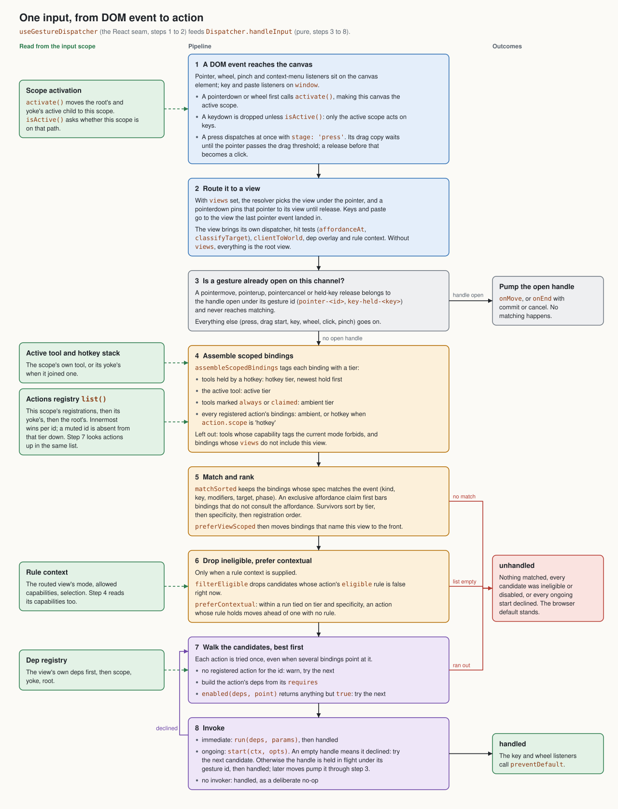
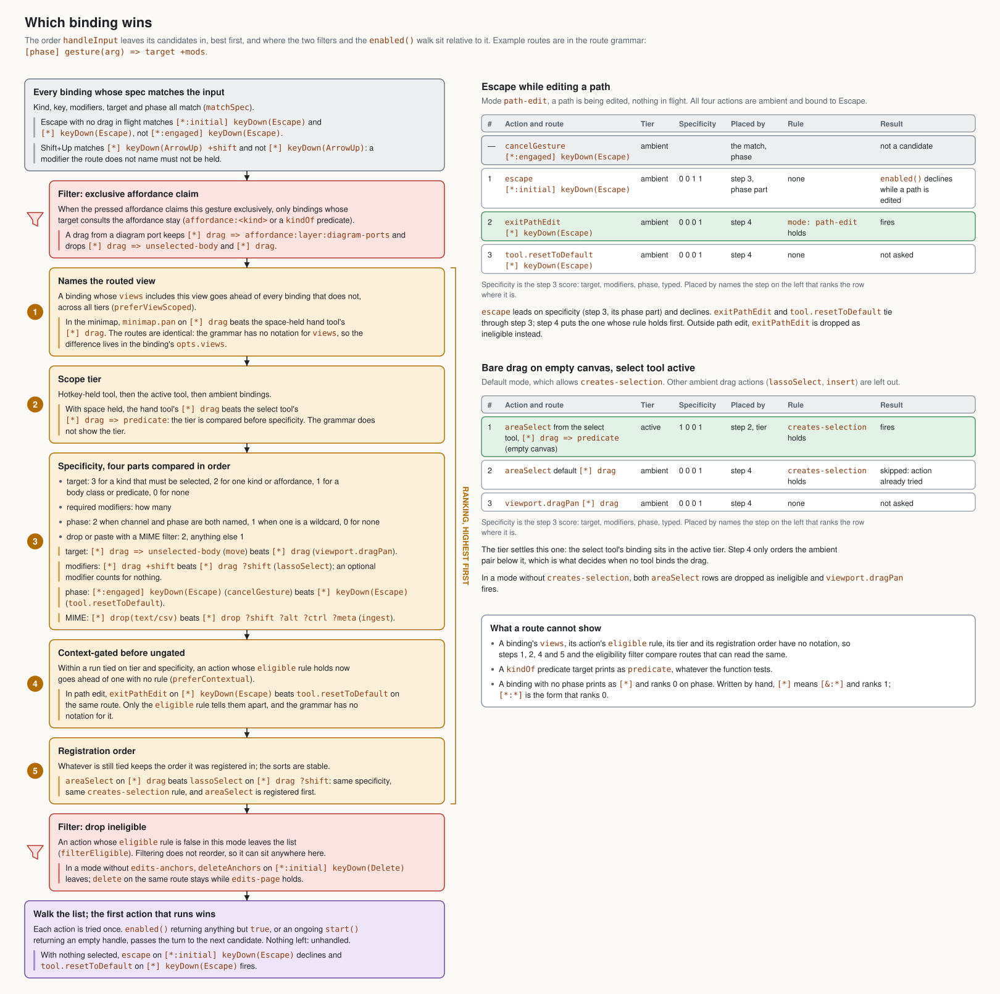
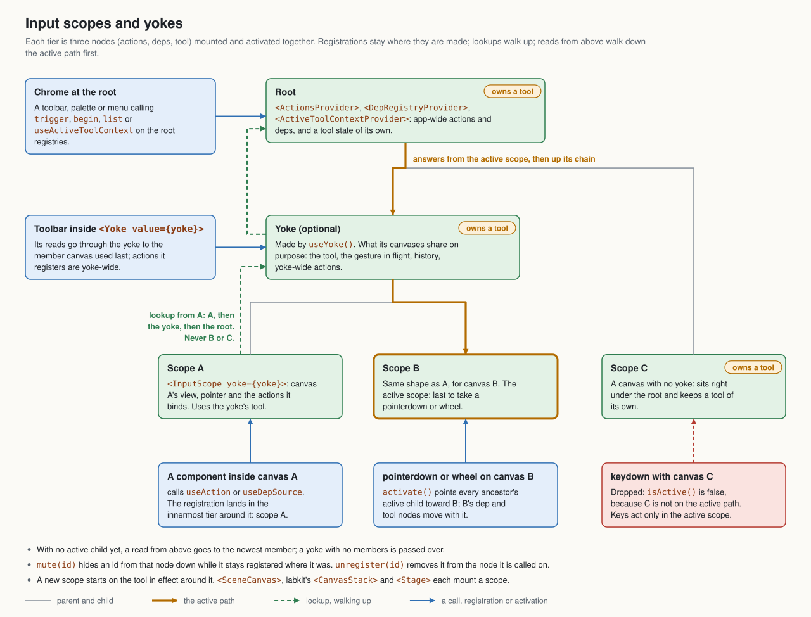

# The gesture dispatcher, in diagrams

For anyone changing or debugging input routing: how one input becomes one
action, which binding wins when several match, and which canvas's registries
answer. The rules themselves are in [taxonomy.md](./taxonomy.md#interaction)
(the precedence table) and [taxonomy.md](./taxonomy.md#input-scope-and-yoke)
(scope tiers); these pictures show how they fit together.

The code is `packages/routing/src/interactions/dispatcher/` (`useGestureDispatcher.tsx`,
`dispatcher.ts`, `matcher.ts`) and `packages/routing/src/interactions/actions/`
(`inputScope.tsx`, `scopeNode.ts`).

## One input, end to end

Steps 1 and 2 happen in the React seam, the rest in the pure dispatcher. The
green boxes are what the canvas's input scope supplies. When an input goes
unhandled, the three red exits say where to look. `Dispatcher.resolveAll`
replays steps 4 to 7 without invoking anything, and gives each candidate a
verdict.

## Which binding wins

The example routes are written in the route grammar that `parseRoute` and
`formatRoute` read and print, defined in
[`packages/gestures/src/grammar/routeGrammar.ts`](../packages/gestures/src/grammar/routeGrammar.ts).

Read it top to bottom, the order the candidate list ends up in.
Naming the routed view outranks the scope tier (see `BindingOpts.views`), so
it comes first. The two examples show the usual pattern: a step decides the
order, and `enabled()` still gets the last word as the walk moves
down the list.

## Whose registries answer

Follow the amber path to see what chrome at the root is talking to, and the
dashed green arrows to see what a canvas can see. A pointerdown or wheel is
what moves the amber path. That is why a keystroke goes to the canvas you last
clicked in, not the one under the pointer.
