# Canvas / SceneCanvas seam — design

Date: 2026-05-24
Status: shipped. Plan: `2026-05-24-canvas-scenecanvas-seam` (plan, deleted at merge).

## Before / after layout

```mermaid
flowchart LR
    subgraph BEFORE["⚙️ BEFORE — entangled seam"]
        direction TB
        subgraph SC_b["&lt;SceneCanvas&gt; <br/> (consumer entry)"]
            direction TB
            sc_b1[Scene subscription]
            sc_b2[Adapter synthesis]
            sc_b3[Kind registry]
            sc_b4[useSelection<br/>own copy]
            sc_b5[useViewportTools<br/>hand + pinch]:::down
            sc_b6[backgroundFill<br/>layer construction]:::down
            sc_b7[HUDs render<br/>CursorCoords + Pick]:::down
            sc_b8[Preview ghost + dispatcher overlay]
            sc_b9[Standard actions + keybindings]
        end
        subgraph C_b["&lt;Canvas&gt; @internal"]
            direction TB
            c_b1[WebGL surface]
            c_b2[View state]
            c_b3[Pointer routing]
            c_b4[Layer composition]
            c_b5[Grid factory]
            c_b6[useSelection<br/>fallback]:::up
            c_b7[pickEvery synthesizer<br/>+ adapter.kindOf read]:::up
            c_b8[selection-overlay<br/>factory call]:::up
            c_b9[cell-highlight<br/>factory call]:::up
        end
        SC_b -->|wraps| C_b
    end

    subgraph AFTER["✨ AFTER — clean seam"]
        direction TB
        subgraph SC_a["&lt;SceneCanvas&gt; — scene-shaped"]
            direction TB
            sc_a1[Scene subscription]
            sc_a2[Adapter synthesis]
            sc_a3[Kind registry]
            sc_a4[Selection<br/>sole owner]:::up
            sc_a5[Hand tool<br/>registry consumer]
            sc_a6[Picking<br/>via makeGetNodeAtPoint]:::up
            sc_a7[selection-overlay<br/>pre-built CustomLayerEntry]:::up
            sc_a8[cell-highlight<br/>slot supplier]:::up
            sc_a9[Preview ghost + dispatcher overlay]
            sc_a10[Standard actions + keybindings]
        end
        subgraph C_a["&lt;Canvas&gt; @internal — scene-agnostic"]
            direction TB
            c_a1[WebGL surface]
            c_a2[View state]
            c_a3[Pointer routing]
            c_a4[Layer composition]
            c_a5[Grid factory]
            c_a6[Pinch zoom<br/>DOM listener]:::down
            c_a7[backgroundFill prop]:::down
            c_a8[HUDs render]:::down
            c_a9[Slot props<br/>onBackgroundClick<br/>getNodeAtPoint]:::new
        end
        SC_a -->|wraps| C_a
    end

    BEFORE ==>|seam refactor 2026-05-24| AFTER

    classDef up fill:#dbeafe,stroke:#1d4ed8,color:#1e3a8a
    classDef down fill:#fef3c7,stroke:#b45309,color:#78350f
    classDef new fill:#dcfce7,stroke:#15803d,color:#14532d
```

**Legend**

- 🔵 Blue — scene-shaped concern that moved **up** from Canvas into SceneCanvas
- 🟡 Yellow — scene-agnostic concern that moved **down** from SceneCanvas into Canvas
- 🟢 Green — new slot props introduced by the refactor

## Honest residue (not in the diagram)

- Canvas retains `selection-overlay` and `cell-highlight` factory call sites as a fallback path for bare-Canvas consumers. SceneCanvas pre-builds and overrides via `CustomLayerEntry`, so those paths are dead in the SceneCanvas case but the code lives on. TODO follow-up.
- `adapter.kindOf` still exists on the adapter contract and is read by `src/tools/dispatcher.ts:29`. Canvas's read is gone; the dispatcher's read is a separate TODO.
- `Canvas.tsx` and `SceneCanvas.tsx` are both still ~1500 LOC each. File splitting is its own follow-up.
- Phase 1 was narrower than originally framed: Canvas owns the `viewport` prop and the pinch-zoom DOM listener; the hand tool stays in SceneCanvas where the registry that consumes it lives. Full Option B (move `useTools` into Canvas) would require also moving `usePreviewGhostLayer` and `GestureDispatcherMounter` — bigger than this phase warranted.
- `onBackgroundClick` is exposed on Canvas as a slot for bare-Canvas consumers but is intentionally NOT wired in SceneCanvas. The select tool's `clearSelection` action binding (routes on `target: 'empty'`) already covers background-click-clears-selection; wiring `onBackgroundClick` on top would double-trigger and break lasso (which commits selection on pointerup-over-background).
