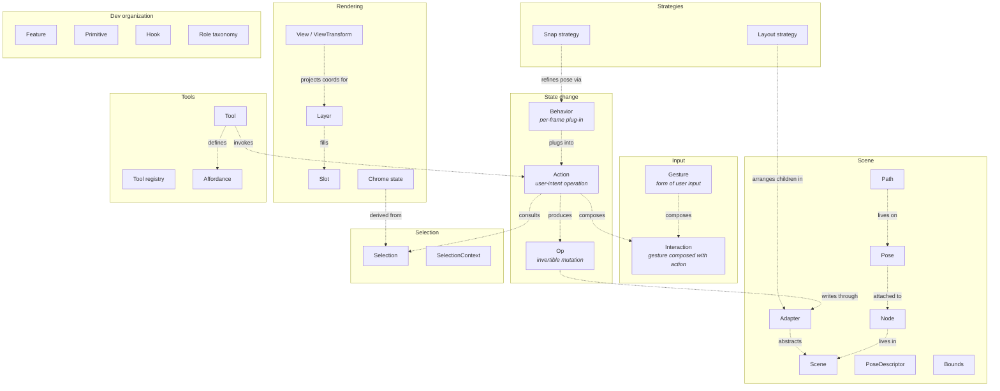

# Weasel Taxonomy

A single source of truth for the kit's terminology, organized by concept-family.
Covers consumer-side abstractions, dev-side abstractions, domain types, the gesture
model, and concepts deferred or not yet in the kit.

This doc is **meta-structure**: what the abstractions *are* and how they relate.
Per-symbol details (function signatures, options, examples) live in JSDoc and the
API reference.

## Conceptual map

Each box is a *domain* — a subsystem with its own vocabulary. Each entry is a
concept in that domain. Arrows show cross-domain relationships.

The diagram is the at-a-glance answer to "where does X live?" Detailed prose
follows below in the per-concept sections.

---

## 1. Consumer-side abstractions

The vocabulary an app developer uses to wire up the kit.

### Tool

A `Tool<TScratch>` record that encapsulates one interaction mode. It declares
channel handlers (`pointer`, `drag`, `keyboard`, `wheel`, `dblTap`), a keybinding,
an optional hotkey-slot trigger, and a `cursor`. The active tool receives pointer
and keyboard events routed from the canvas by the [Tool registry](#tool-registry).
Distinct from [Gesture hooks](#gesture) in that a Tool is a stateful mode (the user
switches between tools) while a gesture hook is a direct binding to a pointer
interaction. Tools in modal states (pen mid-path, text mid-edit) can opt into an
optional `claimsAll(ctx)` predicate that bypasses the affordance layer hit-test
pipeline for the duration of the modal state. See `src/tools/types.ts:103`.

### Affordance

A reusable factory primitive that produces a `{ id, render, hitTest? }` triple consumed by tools. Lives in `src/affordances/`. Tools compose multiple affordances into a single overlay layer via `composeAffordanceLayer`. The dispatcher consults each composite layer's `hitTest` on pointerdown (top-down z-order) before falling through to the active-tool slot walk — so visible chrome is hittable regardless of which tool is currently active.

Examples: `createCornerResizeAffordance`, `createRotationAffordance`. See `src/affordances/types.ts`.

The factory pattern: each affordance instance is bound to one tool/context at runtime (it closes over that tool's controllers via the wrapper drag channel), but the factory function is reusable across tools.

### Tool registry

`useTools({ active, registry, ambient })` — holds the set of registered `Tool`
records, the active-slot id, and the hotkey-engaged id. Returns a `ToolsApi` with
`setActive`, `engageHotkey`, `getActiveOverlays`, and the `dispatcher` that
`<Canvas>` wires to DOM events. Ambient tools listen on all events regardless of
which tool is active (used for always-on zoom and pan tools). See
`src/tools/useTools.ts`.

### Layer

A `RenderLayer<TData>` is a named draw function: `{ id, label, draw(data, view, dims) }`.
Layers are the kit's composable rendering primitive. Each frame the canvas reduces
the active layer stack into a flat `DrawCommand[]` tree and hands it to the
WebGL renderer. Layers declare whether they operate in world space (default) or
screen space. Layers may declare an optional `hitTest(worldX, worldY, data, view, dims)` that the dispatcher consults on pointerdown before the slot walk; first non-null result wins. See `src/core/layers/render.ts`.

### Slot

A named position in the `LayersMap` passed to `<Canvas>`. Standard slots render in
canonical z-order: `grid`, `cellHighlight`, `scene`, `selectionOverlay`. Custom
slots declare an `after` or `before` anchor relative to a standard slot; unanchored
custom slots land at the top of the stack. Slot configs are distinct from raw
`RenderLayer` values — the canvas constructs a `RenderLayer` from each slot config
internally. See `src/canvas/Canvas.tsx:70`.

### Adapter

A consumer-implemented object that bridges the kit to the app's scene state. The
kit never reads or writes scene state directly; it asks the adapter for poses, hit
results, and writes mutations back through `Op` application. Adapter interfaces are
narrow and structural: `MoveAdapter`, `ResizeAdapter`, `RotateAdapter`,
`AreaSelectAdapter`, `InsertAdapter`, `OrderedAdapter`. A single struct satisfying
all of them at once is the common pattern. The opaque `adapter: unknown` on
[`ToolCtx`](#toolctx-gesturecontext) is the same concept but intentionally
untyped at the tool layer; tools cast it when they need a specific facet. See
`src/core/adapters/types.ts` and `docs/adapters.md`.

### Op

An invertible, adapter-agnostic mutation: `{ apply(adapter), invert(): Op, label?, coalesceKey? }`.
Op constructors live in `src/core/ops/`: `createTransformOp`, `createInsertOp`,
`createDeleteOp`, `createSetSelectionOp`, `createSetTextOp`, `createReorderOp`,
`createSetPathOp`, etc. `dispatchApplyBatch(adapter, ops, label)` applies them in
order (or hands them to `adapter.applyBatch` for history integration).

Ops are the *infrastructure layer* of state mutation — atoms of history-bearing
change. [Actions](#action) at the application layer produce op batches to express
user-intent operations; the action↔op mapping is many-to-many:

- **1 action → 1 op**: `delete` → `createDeleteOp`.
- **1 action → N ops**: `align left` → N `createTransformOp`s (one per selected item).
- **0 ops for an action**: `zoom in`, `escape`, `toggle grid` — non-undoable state
  changes bypass the op pipeline.
- **Ops without an action**: a gesture commit can emit ops directly (e.g. a drag
  resize) without dispatching through the action registry. (The longer-term shape
  routes all drag-based mutation through actions; this is acknowledged drift.)

The `coalesceKey` field lets `createHistory({ coalesceWindowMs })` merge consecutive
entries within a window when their op multiset (keyed by `coalesceKey`) matches —
so scrubs of a property slider land as one undo step. See `src/core/ops/types.ts`.

### Gesture

The *form* of user input. A primitive that consumes pointer / keyboard events and
emits world-space data. Examples: `dragRect` (rectangular drag → bounds),
`dragRadial` (radial drag → center + radius), `lasso` (free-form polygon),
`usePointerGestures` (the underlying pointer-event normalizer). Plain clicks and
keystrokes are gestures too, just trivial ones.

Gestures are orthogonal to [Actions](#action) in this taxonomy. A gesture is *how*
input arrives; an action is *what to do* with it. The same gesture (a rectangular
drag) can power different actions (insert a rect, marquee-select, area-erase); the
same action (`delete`) can be invoked by different gestures (a keystroke, a button
click, a swipe). See [Interaction](#interaction) for the composition.

Source layout: `src/interactions/gestures/` holds the input primitives — per-primitive
subdirectories `dragGesture/`, `dragRect/`, `dragRadial/`, `usePointerGestures/`, plus
the shared `shared/` snap helpers and `types.ts` carrying the cross-system base types
(`ModifierState`, `GestureContext`, `ActionBehavior`, etc.). Drag-based actions
(`move/`, `resize/`, `rotate/`, `clone/`, `area-select/`, `lasso-select/`,
`edit-anchors/`, `insert/`) live alongside the one-shot actions under
`src/interactions/actions/`.

### Action

A user-intent operation that modifies app state. Identified by `{ id, label,
defaultBinding?, invoker?, run?(), enabled?() }`. Discoverable via the Actions Registry +
command palette; bindable to a key, mouse gesture, button click, or any other
[Gesture](#gesture). Actions with a `defaultBinding` are routed through the gesture
dispatcher; actions without one fall back to the legacy
`useKeybinding` path.

Actions are the *application layer* of state change — the verbs the user can
invoke. Each one either produces an [Op](#op) batch (for undoable mutations like
`delete`, `align`, `move`) or emits no ops (for transient/UI state like
`zoom in`, `escape`, `toggle grid`).

Source layout reflects this: both one-shot actions (`delete`, `align`, `escape`, …)
and drag-based actions (`move`, `resize`, `rotate`, `insert`, `area-select`, …) live
under `src/interactions/actions/`. All default actions are registered as descriptors
with `defaultBinding` and dispatched through the action registry. The remaining gap: drag-based action descriptors
(`resize`, `rotate`, `areaSelect`, `insert`, `clone`) have stub invokers — their
real behavior still flows through `useResize`, `useRotate`, etc. via `useSelectTool`'s
route tables; full invoker implementations are tracked in `docs/TODO.md`.

Examples: `selectAll`, `escape`, `duplicate`, `nudge`, `reorder`, `delete`,
`align.{left,...}`, `distribute.{horizontal,vertical}`, `flip.{x,y}`. Kit defaults
register automatically via `<SceneCanvas>`; consumer-level actions register
explicitly. See `src/interactions/actions/registry.tsx`.

### Interaction

A [Gesture](#gesture) composed with an [Action](#action). The composition is the
unit at the seam between input and effect: "drag-rect gesture + insert action"
makes a rectangle; "click gesture + delete action" deletes an object; "keystroke
gesture + toggle-grid action" hides the grid.

Interactions don't have their own type or runtime today — they emerge from the
gesture system invoking actions. The term is most useful for *describing* what a
feature does (e.g. "alt-click invokes the eyedropper action") and for keeping the
gesture and action sides of a feature factored separately when designing.

### Behavior

A pluggable extension to a drag-based [Action](#action)'s per-frame proposed-pose
shaping and commit logic. Implements `ActionBehavior<TPose, TProposed, TMoveResult>`
with optional `onStart`, `onMove`, and `onEnd` hooks. Behaviors run in array order;
each `onMove` may refine the proposed pose; the first `onEnd` returning a
non-`undefined` value wins (ops to commit, or `null` to abort). Type aliases pin
the shapes per action: `MoveBehavior`, `ResizeBehavior`, `RotateBehavior`,
`InsertBehavior`, `AreaSelectBehavior`, `CloneBehavior`.

Distinct from [component-level behaviors](#mixin--lifecycle-behavior-deferred)
which do not exist yet. See `src/interactions/gestures/types.ts` for the
`ActionBehavior` interface (renamed from `GestureBehavior` in 2026-05).

### Snap strategy

`SnapStrategy<TPose>` — a pluggable point-snap policy with one method:
`snap(pose, ctx): TPose | null`. Returns the snapped pose or `null` to skip.
Passed to gesture hooks (e.g. `useMove({ snap: gridSnapStrategy(20) })`) or
via the `ToolCtx` snap field to tools. Built-in: `gridSnapStrategy(spacing)`
snaps the pose origin to the nearest grid multiple; `OriginProjection` adapts
non-rect poses (e.g. `Path`) so `gridSnapStrategy` can read and write the
correct origin. See `src/interactions/gestures/shared/strategies/grid.ts`.

### Layout strategy

`LayoutStrategy<TPose>` — a pluggable container-layout policy. Implements
`getChildPositions`, `getDropTargets`, `reflowFor`, `commitDrop`, `snap`, and
an optional `contains` predicate. When a container in the scene exposes a layout
strategy via `adapter.getLayout(containerId)`, `useMove` runs a layout pass on
drag: reflows siblings live and calls `commitDrop` on release. Built-in strategies:
`freeform` (absolute positioning), `tileGrid` (row/column grid), `snapPoint`
(named anchor positions). See `src/layout/types.ts` and `src/layout/strategies/`.

### Selection

`SelectionApi` — the kit's owned selection state, produced by `useSelection`.
Exposes `current: string[]`, `get()`, `set()`, `add()`, `remove()`, `toggle()`,
`clear()`, `contains()`, and `applyClick()`. `applyClick` applies the configured
click policy (`'single'` replaces; `'multi'` toggles with extend key). The
`adapterMethods` sub-object (`{ getSelection, setSelection }`) is designed to be
spread directly into adapters. Selection participates in the `@experimental`
[`SelectionContext`](#selectioncontext) for non-canvas UI. See
`src/core/selection/useSelection.ts`. The kit-level `ChromeState` (the
affordance-facing read-only view) is built from the `SelectionApi` via
`buildChromeState`; lives in `src/core/selection/chromeState.ts`.

### SelectionContext

`@experimental`. An ambient React context populated by `<SceneCanvas>` (via
`usePublishSelection`) that non-canvas UI (palette, status bar) can read without
prop-drilling. Provides the current selection ids and optional per-id `kinds`
labels. The `kinds` parallel array is a temporary half-step toward typed scene
references (see `docs/TODO.md` Tier 1.5). See
`src/features/selection/SelectionContext.tsx`.

---

## 2. Dev-side abstractions

The vocabulary kit authors use when extending or organizing the kit.

### Feature

A directory under `src/features/<name>/` that bundles related primitives sharing a
domain. Examples: `focus`, `selection`, `grid`, `groups`, `text`, `paths`,
`viewport`, `drag`, `patterns`. Not a runtime concept — an organizing principle
for the repo. The mental model (from `docs/TODO.md`): the fix for "the kit is
turning into a katamari." Distinct from a [Plugin](#plugin-deferred) (which bundles
parts with consumer-facing composition rules) in that features are internal to the
kit.

**Bundle-shaped vs protocol-shaped features.** Features fall on a spectrum:

- **Bundle-shaped** features are self-contained. Their primitives compose locally;
  the rest of the kit doesn't need to know they exist. Focus, grid, patterns, text
  are mostly bundle-shaped — if you don't import them, nothing breaks; if you do,
  you wire them at one or two call sites.

- **Protocol-shaped** features introduce a *concept* that other code must honor.
  Selection is the canonical case: "current selection" is read by overlay layers,
  written by gestures, threaded through [Adapter](#adapter) contracts (e.g.
  `AreaSelectAdapter.setSelection`, `getSelection` on Move/Resize/Rotate adapters),
  and conditioned on by [Actions](#action). The selection feature doesn't just
  contribute (api/attrs/layers); it *imposes* — anything that interacts with the
  scene has to understand what selection is and behave accordingly.

The [Role taxonomy](#role-taxonomy) captures contributions *out* of a feature; it
doesn't (yet) capture the protocol surface a protocol-shaped feature *requires* of
other code. In practice the protocol surface is expressed as TypeScript
interfaces (`SelectionApi`, `AreaSelectAdapter`, etc.) — the type system is the
protocol contract, validated at compile time. See
[Feature dependency layers](#feature-dependency-layers) for how this affects the
kit's internal partial order.

**Feature-authoring guide.** When adding or restructuring a feature:

1. **Each feature is a directory under `src/features/<name>/`.** The directory bundles related primitives that share a domain.

2. **Each feature has an `index.ts` barrel.** The barrel re-exports the feature's public primitives — every hook, layer factory, exported type, or helper a consumer or another feature might import. Internal helpers stay un-exported (or are exported only through deeper paths if needed for internal cross-feature wiring).

3. **The kit's main barrel (`src/index.ts`) imports from feature barrels, not from feature-internal paths.** This is the load-bearing discipline — once enforced, internal restructures (renaming a file, splitting a primitive into two) don't ripple through the main barrel.

4. **The [Role taxonomy](#role-taxonomy) is a thinking tool, not a code shape.** When authoring a feature's primitives, sort them mentally: which are state surfaces (api), which contribute DOM attrs (attrs), which contribute render layers (layers). The categorization helps decide what belongs in the barrel and what stays internal. It does NOT manifest as TypeScript types or runtime structures — there's no `Api<S>` alias, no `<SceneCanvas features={[…]}>` prop, no `useFooFeature()` convenience hook by convention.

5. **Protocol-shaped features document their protocol surface explicitly.** Selection's `SelectionApi`, `AreaSelectAdapter`, and the `getSelection`/`setSelection` methods threaded into Move/Resize/Rotate adapters are the model. When a feature introduces a cross-cutting concept other code must honor, name the contracts in TypeScript interfaces and reference them in the feature's docs.

### Primitive

An exported building block from a feature — a hook, layer factory, type, helper,
or utility function. The unit of public consumption. Per-feature primitives compose
into the consumer-side abstractions. Examples: `useCanvasFocus`, `gateLayer`,
`createGridLayer`, `useGridCellHover`, `gridSnapStrategy`. Primitives are exported
directly; features are directories.

### Role taxonomy

A thinking tool for shaping a feature's primitives into a consistent bundle shape.
Three roles a feature's parts fall into (from `docs/TODO.md` "Feature-roles taxonomy"
and `docs/superpowers/specs/2026-05-09-feature-roles-focus-grid-design.md` §A):

- **`api`** — typed surface for cross-feature consumption: live state, refs,
  getters/setters. Cross-feature deps are typed function arguments
  (`useBlurOnEscape(focus.api)`), not a runtime registry.
- **`attrs`** — native DOM attributes and handlers to spread onto the canvas
  host element: `tabIndex`, `onFocus`, `onPointerMove`, `aria-*`. Distinct from
  React props the `<SceneCanvas>` component itself defines.
- **`layers`** — slot-keyed render-layer contributions. Each entry is a
  `<T>(current: RenderLayer<T>) => RenderLayer<T>` function. Provider and wrapper
  roles are deliberately collapsed: a "provider" returns a fresh layer ignoring
  `current`; a "wrapper" composes on top of it. `<SceneCanvas>` seeds each slot
  with `EMPTY_LAYER` and reduces contributions in registration order.

A `useFooFeature()` hook returns any subset of `{ api?, attrs?, layers? }`. The
taxonomy is `@experimental` — promoted to stable once ≥3 features have shipped in
this shape.

### Chrome state

The `ChromeState` object built once per Canvas render and passed to every affordance's `render` and `hitTest` call. Source of truth for selection ids, derived bounds (overlay-aware), multi-union AABB (lazy), and modifier flags. Read-only; affordances dispatch gestures via their drag channel's `ToolCtx`, not through `ChromeState`. See `src/core/selection/chromeState.ts`.

### Hook

A React hook (`use*`) is the kit's primary primitive shape. Hooks encapsulate
stateful logic (gesture phase machines, selection state, history, animation) in a
React-idiomatic way. The kit's architecture choice: no classes, no event emitters,
no singleton stores — hooks compose. Nearly every consumer-side abstraction is
accessed through a hook.

### Feature dependency layers

The kit's features form an implicit partial order based on what they import and
what protocols they consume. Documented here so authors of new features know where
they fit.

- **Foundation** (nothing kit-internal depends on these): `viewport`, `scene`,
  `selection`. Of these, `viewport` is core infrastructure (lives under `src/core/`
  — every canvas needs a `View`, so it's not optional in any meaningful sense);
  `scene` is also core; `selection` is a protocol-shaped feature (lives under
  `src/features/`) that most editor-style apps will pull in.
- **Mid-layer** (depend on foundation): `groups` (scene + selection), `grid`
  (viewport), `focus` (nothing internal), `paths`, `patterns`, `text`.
- **Gestures** (depend on foundation + adapter contracts): `useMove`, `useResize`,
  `useRotate`, `useAreaSelect`, `useInsert`, `useClone`, `useDragRect`.
- **Actions** (depend on selection + scene): `useDuplicate`, `useDelete`,
  `useNudge`, `useReorder`, `useSelectAll`, `useEscape`, plus the
  [Actions Registry](#action) defaults.
- **Tools** (depend on gestures + actions): `useSelectTool`, `useInsertTool`,
  `useHandTool`, `useUserPenTool`, the viewport tools.
- **Top-level** (depends on most things): `<Canvas>`, `<SceneCanvas>`.

This order is not enforced at runtime; TypeScript module imports are the actual
dependency graph. The layering above is descriptive of what existing imports
already look like — useful for placement when adding a new feature, not a thing
the build validates.

**Cycle-breaking conventions.** Some features have bidirectional needs. Selection
↔ scene is the canonical case:

- Selection needs to react to scene mutations (e.g., remove a deleted node's id
  from the selection set).
- Scene's overlay layers need to react to selection changes (e.g., redraw outlines
  when the selection changes).

The kit avoids module-level cycles by making one side **subscribe** instead of
**import**. Selection subscribes to scene's `onChange` callbacks; scene exposes
events but does not import selection. The runtime relationship is bidirectional,
but compile-time imports stay acyclic.

**Convention:** when two features have bidirectional needs, one side owns state
and exposes a `subscribe` (or callback) API; the other side subscribes. The
"subscribed to" side stays oblivious of the subscriber. The static import graph
remains a DAG.

---

## 3. Domain types

Vocabulary for the geometry and scene model.

### Pose

The snapshot of a scene object's geometry that the kit reads and writes.
Shape is generic (`TPose`). Common shapes: rect (`{x, y, width, height}`),
`RotatedPose` (rect + `rotation: number` in radians, pivot at AABB center),
`Path` (polygon/bezier command stream), `TextPose`. Poses are **local-coordinate**
— relative to the object's direct parent (world-frame for root objects). The
kit composes world poses via `composeWorldPose` for rendering and hit-testing.
See `src/interactions/gestures/types.ts:108` (`ResizePose`, `RotatedPose`) and
`src/features/paths/types.ts` (`Path`).

### PoseDescriptor

`PoseDescriptor<TPose>` — a small projection that bridges an arbitrary `TPose` into
the kit's rect-driven machinery. Required methods: `getBounds(pose) → ResizePose`
(AABB), `remapBounds(pose, src, dst) → TPose` (affine remap on resize or group
scale). Optional: `translate`, `intersectsRect`, `lerp`, `getRotation`. Used by
`useResize`, area-select, snap, and animation helpers. Built-ins:
`RECT_POSE_DESCRIPTOR` (identity for `ResizePose`), `ROTATED_POSE_DESCRIPTOR`,
`pathPoseDescriptor`. Distinct from [OriginProjection](#snap-strategy) which handles
snap-point extraction for non-rect poses. See `src/interactions/actions/resize/geometry.ts:15`.

### Scene

`Scene<TData, TLayer, TPose>` — the kit-owned tree of scene nodes with built-in
undo/redo. Created by `useScene`; passed to `<SceneCanvas>`. Exposes `add`,
`remove`, `update`, `setPose`, `move`, `reorder`, `batch`, `undo`, `redo`, and a
`subscribe` seam for React integration. Mutations are auto-undoable; the
`recordOp` seam extends the history with consumer-defined ops. Distinct from a
flat-array adapter wired through `useArrayAdapter` — the Scene is the higher-level
path with first-class containers and layers built in. See `src/core/scene/types.ts:83`.

### Node

`Node<TData, TLayer, TPose>` — a single entry in the scene tree. Either a `LeafNode`
(`kind: 'leaf'`) or a `ContainerNode` (`kind: 'container'`, with `children: NodeId[]`).
Every node carries `id`, `layer`, `pose`, `data`, and `parent`. The opaque `data`
field holds the consumer's domain payload; the kit never inspects it. See
`src/core/scene/types.ts:17`.

### View / ViewTransform

`View` — the viewport's camera state: `{ x, y, scale }` where `x/y` is the world
point rendered at the canvas top-left and `scale` is pixels per world unit. The
canonical pan+zoom representation used throughout the kit. `ViewTransform` is a
legacy shape (`{ panX, panY, zoom }`) with the opposite sign convention for
translation; `viewToTransform(view)` bridges between them. See
`src/core/viewport/view.ts`.

### Bounds / ResizeAnchor

`ResizePose` (also called "bounds" in hit-test and overlay contexts) is
`{ x, y, width, height }` — the minimum rect shape the resize machinery requires.
`ResizeAnchor` describes which corner/edge stays fixed during a resize:
`{ x: 'min' | 'max' | 'free', y: 'min' | 'max' | 'free' }`. The pair is the
spatial vocabulary of resize math. See `src/interactions/gestures/types.ts:102`.

### Path

`Path = PolygonPath | RectPath` — the kit's vector-graphics pose type. `PolygonPath`
is an SVG-style command stream (`commands: Uint8Array`, `coords: Float32Array`);
`RectPath` is an axis-aligned-rectangle fast path. Multi-contour shapes use
multiple `M`/`Z` pairs. The `kind` discriminant lets the polygon kernels
short-circuit on `'rect'` without the full path kernel. See
`src/features/paths/types.ts`.

---

## 4. Gesture model

Vocabulary for pointer-driven interactions.

### Gesture

A pointer-driven interaction with a `start` / `move` / `end` / `cancel` lifecycle.
Each gesture is a hook that returns a **controller** (`MoveController`,
`ResizeController`, `RotateController`, `InsertController`, `AreaSelectController`)
whose `overlay` field holds live in-flight state for rendering ghosts and chrome.
Gesture hooks: `useMove`, `useResize`, `useRotate`, `useInsert`, `useAreaSelect`,
`useClone`, `useDragRect`, `useDragGesture`, `useEditAnchors`. Distinct from
[Actions](#action) which are one-shot and have no drag phase.

### Gesture overlay

The live state a gesture controller exposes during an active gesture. Consumed by
overlay layers to render in-flight chrome (move ghost, resize handles, insert
preview, marquee). Shape varies per gesture: `MoveOverlay` (dragged ids, live poses,
snap target), `ResizeOverlay` (id, current/target pose, anchor), `RotateOverlay`,
`InsertOverlay`, `AreaSelectOverlay`. Post-Tool-primitive migration the overlay is
surfaced through the active `Tool`'s `previewPose` / `previewBounds` / `previewIds`
so `<Canvas>` can compose it without knowing which gesture hook is internally active.
See `src/interactions/gestures/types.ts`.

### ToolCtx / GestureContext

Two distinct context shapes that appear at different layers:

- **`ToolCtx<TScratch>`** — the per-event context injected into every tool channel
  handler by `<Canvas>`. Carries `worldX/Y`, `modifiers`, `selection`, an opaque
  `adapter`, `applyBatch`, `view`, `setView`, `canvasRect`, and `scratch` (the
  tool's per-gesture mutable store). See `src/tools/types.ts:28`.

- **`GestureContext<TPose>`** — the per-frame context passed to
  [Behavior](#behavior) methods inside gesture hooks. Carries `draggedIds`,
  `origin`, `current` (live pose map), `snap`, `modifiers`, `pointer`, `adapter`
  (typed as `MoveAdapter`), and `scratch` (per-gesture key/value store). More
  gesture-specific than `ToolCtx`. See `src/interactions/gestures/types.ts:26`.

### Pointer gestures (`usePointerGestures`)

`usePointerGestures` — a lower-level compositor that wires `useMove`, `useResize`,
`useRotate`, `useInsert`, and `useAreaSelect` controllers into a single set of
`onPointerDown/Move/Up/Cancel` React handlers. This is the pre-Tool-primitive
entry point; most new code uses `useTools` + `useSelectTool` / `useInsertTool`
instead. See `src/interactions/usePointerGestures.ts`.

---

## 5. Other recurring concepts

### Backend

The kit renders exclusively via **WebGL2** through `WeaselRenderer`
(`@weasel-js/gl` was a separate package until Step 10; its sources are now
folded into `src/renderer/`). The 2D canvas codepath was deleted in Step 10
(2026-05-09). The `backend` prop existed temporarily during the soak period and is
gone. WebGPU is a future option tracked in `docs/TODO.md`. See
`docs/superpowers/plans/2026-05-09-webgl-step-10-done.md`.

### Op coalescing

`Op.coalesceKey` is declared on `transform` and `setText` ops (and `reparent`)
as a string key that could identify ops safe to merge with their predecessor in
the undo history. The field is **written** but `History.append` does not yet
coalesce — every drag step pushes a discrete entry. Implementation (time window?
consecutive same-key only?) is deferred as Tier 1.5 in `docs/TODO.md:199`.

### Selection overlay

The `selectionOverlay` slot renders the per-object selection chrome: outline rect,
corner resize handles, and (when `rotationHandle` is enabled) a rotation handle.
Built from `createSelectionOutlineLayer`, `createSelectionHandlesLayer`, or the
combined `createSelectionOverlayLayer`. The overlay reads overlay-aware pose
lookups (live gesture pose wins over committed adapter pose) so handles track
objects during a drag. The selection overlay is screen-space-constant for handle
sizes but world-space for object positions. See
`src/features/selection/overlay.ts`. Phases of the chrome-affordances refactor
(spec: `docs/superpowers/specs/2026-05-10-chrome-affordances-design.md`) introduced
kit-level affordance factories (`createCornerResizeAffordance`,
`createRotationAffordance`) that render the same chrome via reusable primitives;
`createSelectionOverlayLayer` still exists as the legacy presentational helper.
The two coexist until the cleanup completes.

---

## 6. Concepts not in the kit (yet)

These have been discussed but are not shipped. Mentioned here so design
conversations don't re-litigate whether they exist.

### Plugin (deferred)

A convention for bundling a feature's parts (`tool`, `layers`, `behaviors`, …) so
a single `useFooPlugin()` call returns an object the consumer spreads into
`<Canvas>` / `useTools`, instead of wiring three or four separate exports per
feature. Deferred until ≥2 plugin-shaped features have shipped and the pattern is
clear. A lightweight `WeaselPlugin = { tool?, layers?, behaviors?, ... }` shape
plus `mergePluginConfig(...plugins)` is the v1 target. Tracked in
`docs/TODO.md:138`.

### Mixin / lifecycle behavior (deferred)

Component-level chain-of-responsibility hooks (`onPointerDown`, `pre-render`,
`post-render`) that would let features attach to the canvas lifecycle without
modifying `<SceneCanvas>` directly. Discussed but explicitly not in scope per the
feature-roles spec (`docs/superpowers/specs/2026-05-09-feature-roles-focus-grid-design.md` §Non-goals).
Distinct from gesture-level [Behaviors](#behavior) which already ship.

### Capability registry (deferred)

A runtime DAG for cross-feature dependency resolution — typed indirect references
between features (a "provides/requires" contract) rather than direct TypeScript
import arguments. Explicitly deferred: the in-tree dependency graph is TypeScript
imports; typed function arguments (`useBlurOnEscape(focus.api)`) carry cross-feature
deps for now. Tracked in the feature-roles spec.

### Behaviors at the component level (deferred)

The term "behavior" is used in two senses in the kit:
1. **Gesture-level** ([`ActionBehavior`](#behavior)) — ships and is stable.
2. **Component-level** — a hypothetical chain-of-responsibility mechanism that
   would let features intercept pointer events or render passes at the `<SceneCanvas>`
   boundary. This second sense does not exist yet and is explicitly out of scope
   of the current feature-roles work.
